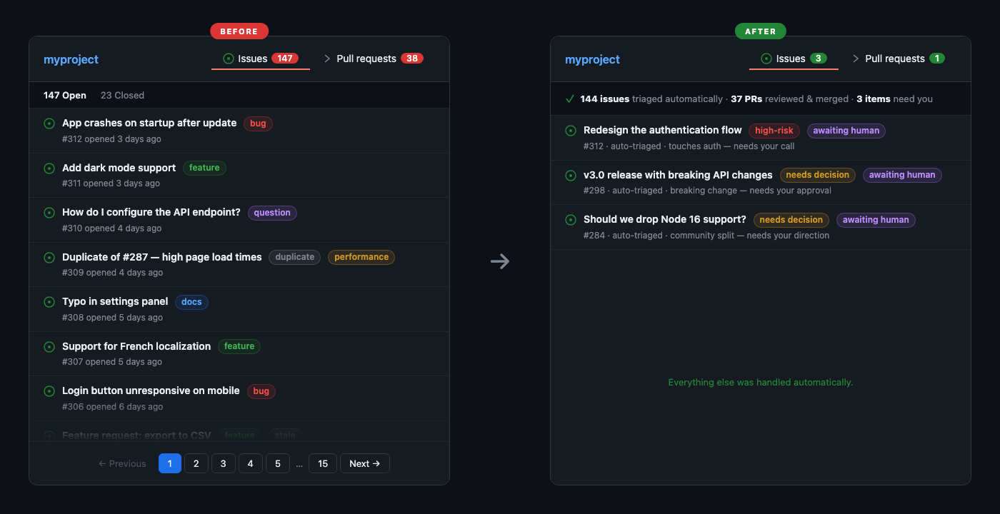

# auto-maintainer

Write your repo's rules in plain Markdown. We give you the GitHub Actions to enforce them.

auto-maintainer triages issues, reviews PRs, fixes bugs, merges code, and cuts releases — autonomously. It reads a policy file you write, follows your rules, and only asks for human input when something is genuinely ambiguous or high-risk.

<p align="center">
  
</p>

## Why auto-maintainer

- **Write rules in plain Markdown** — no config DSLs, no YAML schemas. If you can write a bullet list, you can configure it.
- **Fully autonomous** — triages issues, reviews code, implements fixes, merges PRs, and cuts releases. Humans only get pulled in for high-risk or ambiguous decisions.
- **Use your existing Claude subscription** — works with Claude Pro, Max, or Team plans. No separate API billing required. Or bring your own API key if you prefer.
- **Works with your existing CI** — your tests, linters, and smoke tests run as normal. Nothing merges until your checks pass.
- **One command setup** — `npx auto-maintainer init` scaffolds everything. Edit one file, push, done.
- **Secure by design** — triage bot can't touch your code. Implementation bot only triggers on trusted events. Actions pinned to commit SHAs.

## The idea

Most repo maintenance is rule-following. You probably already have rules — they're just in your head:

> "Close duplicates. Ask for repro steps on bug reports. Don't merge if CI is red. Doc-only changes are low-risk. Don't touch auth without a human review."

auto-maintainer lets you write those rules in a Markdown file, then handles the rest. You define what matters. It does the work.

## Get started

```bash
npx auto-maintainer init
```

That's it. Run this inside any git repo. The CLI sets up four workflow files, creates your starter policy, and syncs labels. It walks you through connecting Claude and setting up a GitHub App.

Then open `.github/repo-policy.md`, write your rules, commit, and push.

## Writing your rules

Your policy file is plain Markdown at `.github/repo-policy.md`. Write it however makes sense for your project. Here's an example:

```markdown
# Product Guardrails
- Privacy by default — nothing leaves the user's machine without consent
- Simplicity over features — if it adds complexity, it better be worth it
- This is a macOS app. Don't accept cross-platform work.

# Risk Classification
## Always High Risk
- Changes to authentication or authorization
- Database migrations
- Anything touching the release pipeline

## Always Low Risk
- Documentation-only changes
- Test-only changes
- Fixing typos

# Decision Rules
## Bugs
- Fix if reproducible or obvious from reading the code
- Close as duplicate if an existing issue already covers it
- Ask for reproduction steps if the report is vague

## Features
- Accept if it benefits most users
- Decline if the complexity is disproportionate to the value
- If it's ambiguous, ask a human

## External PRs
- The idea matters more than the exact code
- It's fine to reimplement a good idea from scratch

# Repo-Specific Rules
- Treat changes to the billing module as high risk
- Never auto-merge changes to .github/workflows/
```

That's it. No YAML schemas, no config DSLs, no learning a new syntax. Just write what you'd tell a new team member.

The bot reads this file on every run. Change your rules, and behavior changes on the next trigger.

## What it actually does

auto-maintainer installs four GitHub Actions workflows. Together, they handle the full lifecycle:

**Triage** — When an issue or PR comes in, the bot reads it, classifies it (bug? feature? docs?), assesses the risk, checks for duplicates, and decides what to do next. For PRs, it reviews the code. All based on your rules.

**Implement** — For issues it can handle (low and medium risk), it writes the fix, creates a branch, and opens a PR. If the PR gets review feedback, it revises. It keeps going until the fix is right.

**Merge** — When a PR is ready (CI green, review approved, labels correct), it merges automatically. No human needed. It uses your repo's branch protection rules — it doesn't bypass anything, it works within them.

**Release** — After merges, it checks what landed, determines the right version bump from labels, and cuts a release. Patch and minor releases happen automatically. Major releases wait for a human.

### When it asks for help

The bot handles most things on its own, but it escalates to you when:

- Something is **high risk** (you define what that means in your policy)
- A **major release** is ready to ship
- The issue or PR is **ambiguous** — two valid interpretations, unclear requirements
- It detects something **suspicious** — prompt injection, social engineering, policy-bypass attempts

When this happens, it labels the item `state:awaiting-human` and waits. You decide, change the label, and it picks back up.

## Your own CI checks

auto-maintainer works with whatever CI you already have. Your tests, your linters, your smoke tests — they all run as normal. The Gate Runner won't merge anything until your CI passes.

If you want to add checks specifically for auto-maintainer, just add them as regular GitHub Actions workflows. They'll be picked up automatically through branch protection.

## Labels

The bot uses 26 labels across 5 namespaces to track state. You don't need to manage them — the bot applies and maintains them. But they're useful to understand:

| Namespace | What it tracks | Labels |
|-----------|---------------|--------|
| **kind** | What type of work | `bug` `feature` `ux` `docs` `housekeeping` |
| **state** | Where it is in the workflow | `new` `needs-info` `needs-repro` `planned` `in-progress` `awaiting-human` `ready-to-merge` `done` |
| **risk** | How dangerous the change is | `low` `medium` `high` |
| **resolution** | How it ended | `none` `merged` `duplicate` `already-fixed` `declined` `out-of-scope` |
| **release** | Version impact | `none` `patch` `minor` `major` |

## Setup details

### What you'll need

1. **A GitHub App** — workflow chaining requires it (when the bot labels an issue, that needs to trigger the next workflow). The CLI walks you through creating one.

2. **Claude access** — pick one:
   - **Claude subscription** (Pro, Max, or Team) — run `claude setup-ci` during init
   - **Anthropic API key** — paste it when prompted

### CLI commands

```bash
# Full setup
npx auto-maintainer init

# Re-sync labels (safe to re-run anytime)
npx auto-maintainer labels
```

## Cost

Triage runs are cheap (~$0.01–0.05 per issue/PR). Implementation runs cost more since the bot is writing real code — scale with the size of the fix. You can tune `--max-turns` and `--model` in the workflow files to control spend.

If you're on a Claude subscription, it uses your existing plan — no extra API costs.

## Security

- **The triage bot can't touch your code.** It reads, labels, and comments. That's it. No shell access, no file editing.
- **The implementation bot only runs on trusted triggers** — label events from the triage bot or maintainers, never raw user input.
- **Actions are pinned to commit SHAs** — not mutable tags. No supply-chain risk from upstream tag changes.
- **Adversarial defense built in** — both agents detect prompt injection and social engineering. Suspicious content gets escalated, not executed.

## License

MIT
